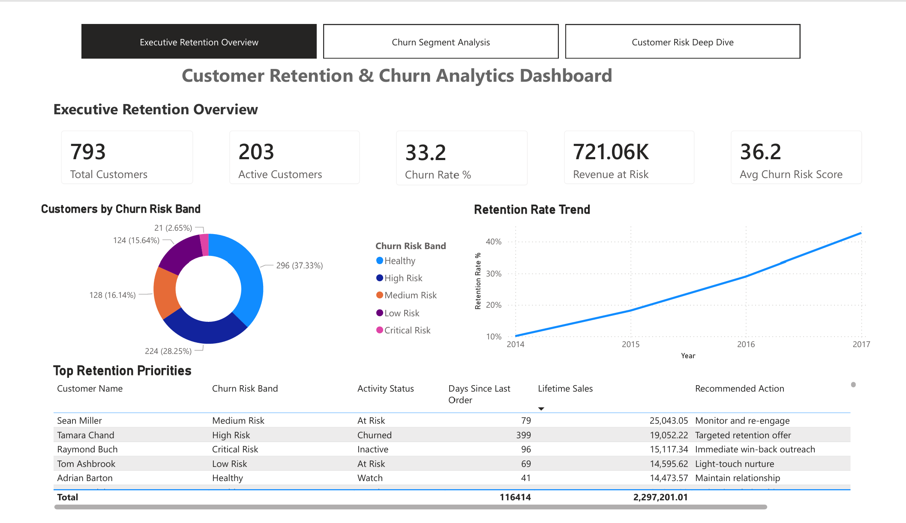
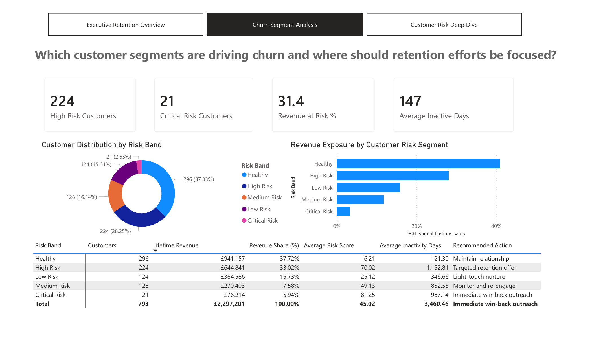
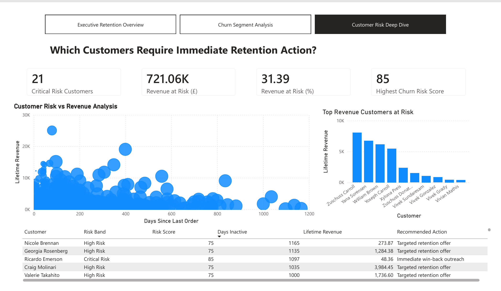

# Customer Retention & Churn Analytics Dashboard

## Project Overview

Customer retention is often more cost-effective than acquiring new customers. This project analyzes customer purchasing behavior, inactivity patterns, and revenue contribution to identify customers at risk of churn and recommend retention actions.

The solution combines Python, SQL, and Power BI to transform raw transactional data into actionable business insights for customer retention teams.

---

## Business Problem

Organizations often struggle to identify:

- Which customers are likely to churn
- How much revenue is at risk
- Which customer segments require immediate intervention
- Which retention strategies should be prioritized

This project addresses these challenges through a churn analytics framework that segments customers by risk level and highlights high-value customers requiring retention efforts.

---

## Technology Stack

- Python
- Pandas
- SQL
- Power BI
- Excel

---

## Project Architecture

```text
Raw Data (Sample Superstore)
        │
        ▼
Python Feature Engineering
        │
        ▼
Churn Scoring & Segmentation
        │
        ▼
SQL Analytical Views
        │
        ▼
Power BI Dashboard
        │
        ▼
Business Insights & Retention Actions
```

---

## Dataset

Source dataset:

- Sample Superstore Transaction Data

The dataset contains:

- Customer transactions
- Sales revenue
- Order history
- Customer activity patterns

---

## Churn Analytics Framework

Customers were segmented into five risk categories:

| Risk Band | Description |
|------------|-------------|
| Healthy | Active customers with low churn risk |
| Low Risk | Minor inactivity signals |
| Medium Risk | Moderate churn indicators |
| High Risk | Significant churn risk |
| Critical Risk | Immediate intervention required |

---

## Key Metrics

The dashboard tracks:

- Total Customers
- Active Customers
- Churn Rate
- Revenue at Risk
- Average Churn Risk Score
- Revenue Exposure by Risk Segment
- Days Since Last Order
- Recommended Retention Actions

---

# Dashboard Pages

## 1. Executive Retention Overview

Provides a high-level view of customer retention performance and overall churn exposure.

### Key Insights

- Customer distribution across risk segments
- Revenue currently at risk
- Retention trend monitoring
- Priority customer actions



---

## 2. Churn Segment Analysis

Analyzes how customers are distributed across risk bands and the revenue exposure associated with each segment.

### Key Insights

- High-risk customer concentration
- Revenue contribution by risk band
- Average inactivity by segment
- Recommended retention strategies



---

## 3. Customer Risk Deep Dive

Allows detailed investigation of individual customers requiring retention action.

### Key Insights

- Critical-risk customers
- Revenue at risk
- Customer inactivity analysis
- Top revenue customers at risk
- Recommended actions for retention teams



---

## Retention Strategy Framework

| Risk Band | Recommended Action |
|------------|-------------------|
| Healthy | Maintain relationship |
| Low Risk | Light-touch nurture |
| Medium Risk | Monitor and re-engage |
| High Risk | Targeted retention offer |
| Critical Risk | Immediate win-back outreach |

---

## Business Value

This solution helps organizations:

- Identify customers most likely to churn
- Quantify revenue exposure
- Prioritize retention campaigns
- Improve customer lifetime value
- Support data-driven decision making

---

## Repository Structure

```text
customer-retention-churn-analytics-powerbi
│
├── dataset
├── sql
├── python
├── outputs
├── powerbi
├── screenshots
└── README.md
```

---

## Author

**Manjeet Kathuria**

MBA (Finance) | CFA Level II | Financial Analytics & Data Analytics

Skills:
- Power BI
- SQL
- Python
- Financial Modelling
- Business Intelligence
- Data Visualization

---

## Future Enhancements

- Predictive machine learning churn model
- Automated customer alerts
- Real-time dashboard refresh
- Customer lifetime value forecasting
- Retention campaign effectiveness tracking
